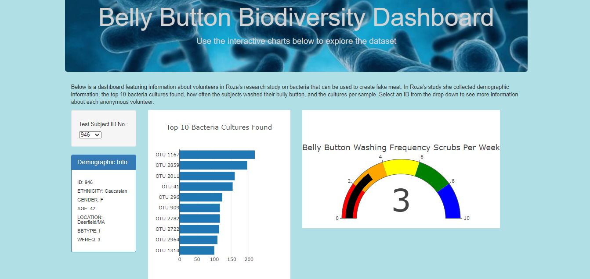

Javascript Analysis & Plotlydeployment
In this module I practiced using javascript, html, and css to create a dynamic web page deployed using Github Pages. 

Included on the web page is a dashboard featuring information about volunteers in a research study on bacteria that can be used to create fake meat. The study collected collected demographic information, the top 10 bacteria cultures found, how often the subjects washed their belly button, and the cultures per sample. You can select an ID from the drop down to see more information about each anonymous volunteer. 

